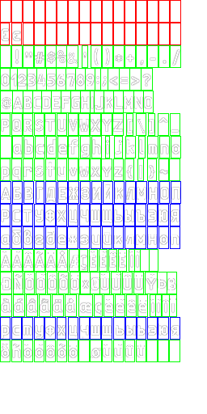

## Armada Tanks *.df Font type converter

Fonts used in-game is like this:

And some font type I never managed to search online about:

- [FontAdv_FD.df](df_fonts/224/FontAdv_FD_224.df)

---

Now I managed to somewhat reconstruct `.df` into AngelCode's BMFont format `.fnt`

Converted fonts are in [output](output) dir.

Pretty similar, ey?

Unfortunately can't seem to adjust padding. Padding parameter does absolutely nothing in godot.

Maybe I need to adjust xadvance instead.
