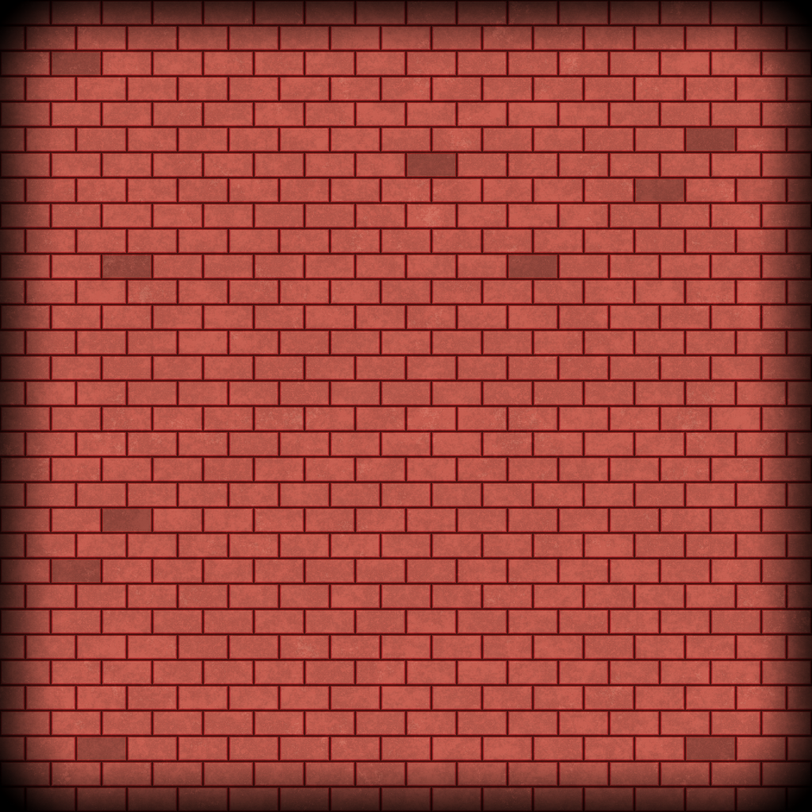
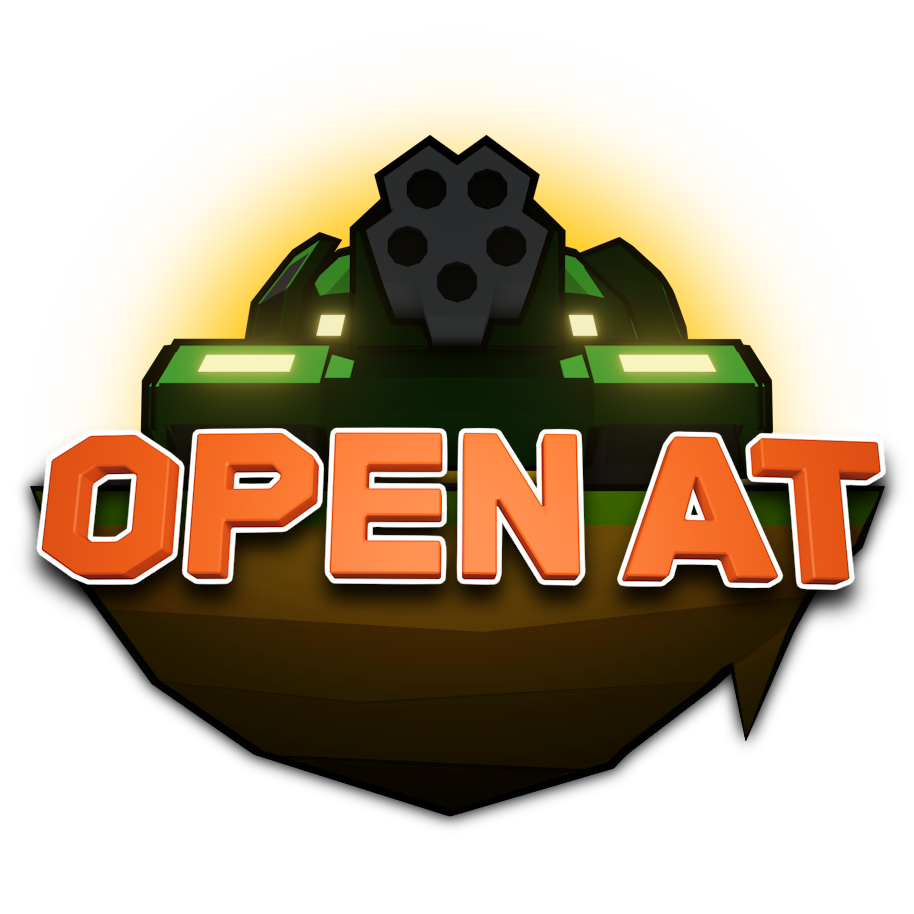

Collections of handmade image/textures.

List is in reverse of creation order.

# custom_brick

Created to replace heartless black voids of `ui_blackbar`.

# logo

Uses [Obsolete handcrafted model](/CustomResources/Models/tank_sample) and
[logo text model](/CustomResources/Models/logo_text) with *Paint.NET* treatments.

# ui_blackbar

Created to allow godot use `Expand` with `canvas_item` yet allowing UI to expand freely over letterbox -
while limiting rendered stuff's aspect ratio (despite it still being rendered), so outside of map isn't visible. 

this Simply hides extra sides around display, so it's not a perfect solution. 

# wireframes

Wireframes for custom blender models that was used in early stage of project.

