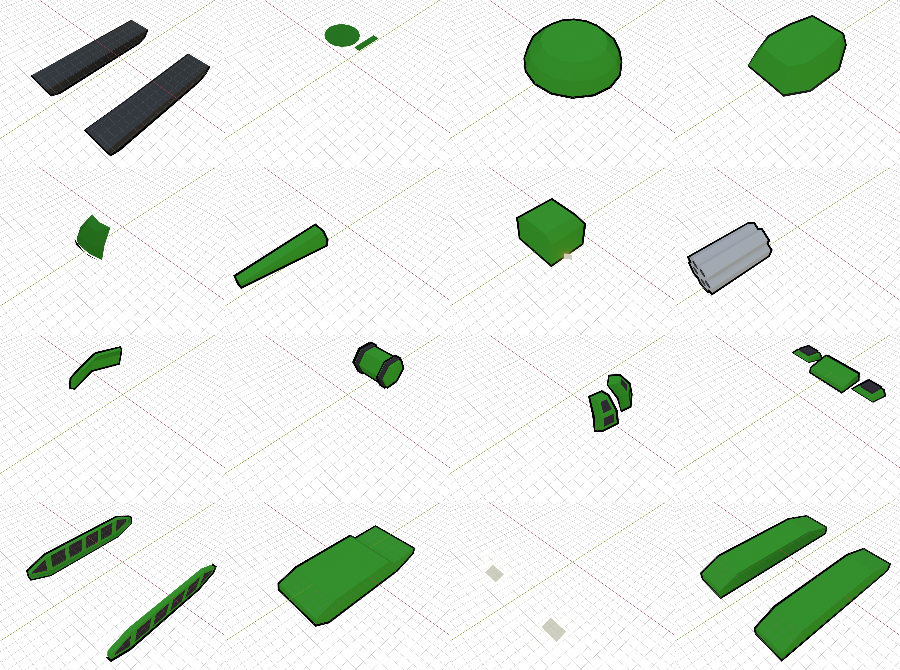

Collections of handcrafted models.

Despite simple looking, since I made each almost at 'typing each vertex coordinates' level, took way more time than it
looks like.

Order is inverse of creation time.

# lighting_bullet

For implementing Lightning weapon effect, because in 'modern' game engines we can't create mesh and edit UV in runtime!

Following is actual in-game implementation with this countless models, last 3 being extension and not modeled.

# tracks

Reconstructed models for use in godot. Material will be created with ADD blend mode on runtime, so black bg is fine.

# wall

Wall parts for each connection types.

This looks like a simple system without much attention, but actually is quite a bit of complex design.

As wall model doesn't exist in-game (presumably was easy enough to create with code?) - had to make one.

Actual wall connection system/model test vs original

# terrain Version 2 (OpenAT)

Initial prototype for OpenAT before succeeding in decoding possibly in-house `*.dtm` model files.

Close enough from far, but not accurate close-up, despite hours went into it.

# tank_sample

Originally made for [OpenArmada](https://youtu.be/y9SxrjWGQ5Y?si=N4GB5dVoKe6rwVIC).

Separated every individual parts to allow modularization.  

After seeing Godot's built-in ***POWERFUL*** (Add 10x stronger emphasis here) outline mesh generation feature,
created a Simple headless Godot application wrapped with python called
[GLTFOutlineCreator](https://github.com/jupiterbjy/GLTFOutlineCreator).

With this tool, I ditched [old scale-based outline script](tank_sample/batch_export_w_invert_outline_mesh.py) and
created proper outline mesh for these as test.

This made somewhat lame models much more badass, decided to use build logo upon this.

# terrain Version 1 (OpenArmada)

Even more ancient models that existed before this project for a concept project
[OpenArmada](https://youtu.be/y9SxrjWGQ5Y?si=N4GB5dVoKe6rwVIC).

