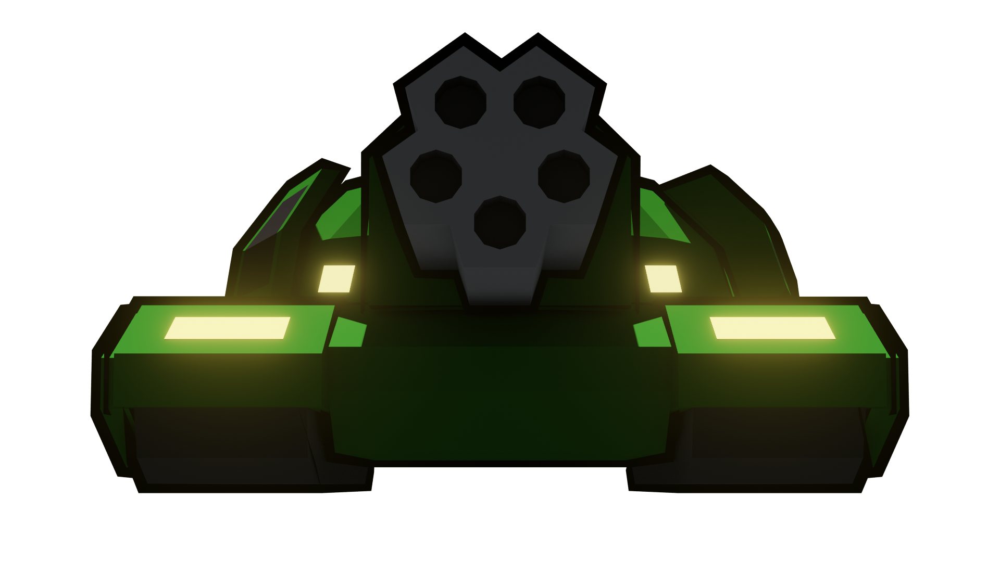

# Prototype Tank models

Before this became full-effort project as our original graduation project failed, this was used to [prototype unity implementation](https://youtu.be/y9SxrjWGQ5Y?list=PLmaqFP6jEVilsSr2wSDV2J_ygrFlqOG-5).

After OpenAT project started, I upgraded outlines and few defects to use this as base our project's logo.

Blender render of model:

---

## Combinations

