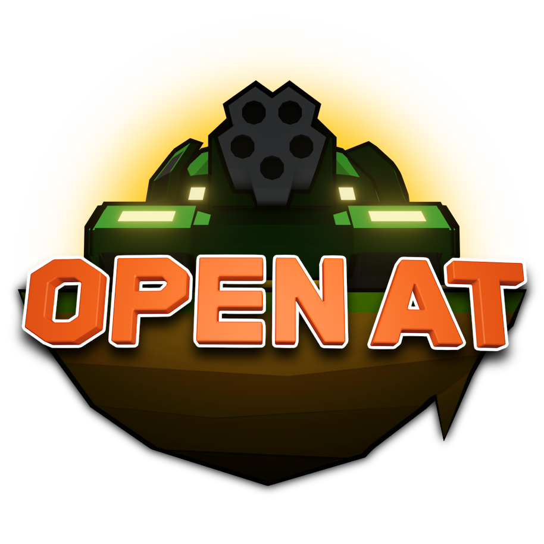

# OpenAT

Logo is incomplete, might see bit more work on it (if I have time before deadline)

## Introduction

An Open source Godot recreation project of Armada Tanks, a great arcade game by:

- Denis Kotov: Game Design, Programmer, Level design, Art & Graphics
- Pasha Oliynyk: Art & Graphics
- Yaroslav Yanovsky: Producer
- Message(??): Music Composition, Sound Design 

Currently we couldn't solve the hard-dependency to Armada Tanks game resources, thus uploading godot project right now will violate the copyright.
After game implementation is complete, we will start migrating hard dependency outside game so we can upload the project file.
Then dependencies can be supplied by users manually.  

## Repo Structure

### [Decoded](Decoded)
Contains Markdown documents produced from our reverse-engineering efforts & few helper scripts.
Majority of project's efforts went into this decoding part.

### [ConversionScripts](ConversionScripts)
Resulting scripts of reverse-engineering efforts on *Armada Tanks*'s seemingly own in-house format.

- [ImageFontSplitter](ConversionScripts/ImageFontSplitter): Old script for splitting each letters from font image. No longer used.
- [DF2FNT](ConversionScripts/DF2FNT): `*.df` font format conversion script. Converts fonts into AngelCode's *BMFont* format.
- [DTM2Blender](ConversionScripts/DTM2Blender): DTM model reconstruction & model definition reconstruction script. Uses black magic trickery to allow Blender's GLTF exporter export mesh, UV and vertex animations properly.
- [Tex2JSON](ConversionScripts/Tex2JSON): `texture*.scr` texture definition scripts reconstruction script. Also translates DX8 Blending specifiers.  

### [Model](Model)
Collection of old models.

- Converted: Converted DTM model resource - not uploaded due to potential copyright issue.
- [FromScratch](Model/FromScratch): Models made from scratch in blender. Refer README.md in each respective models.
